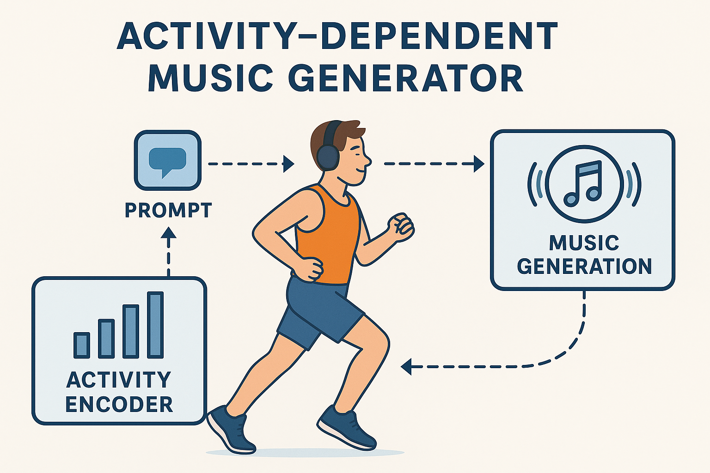
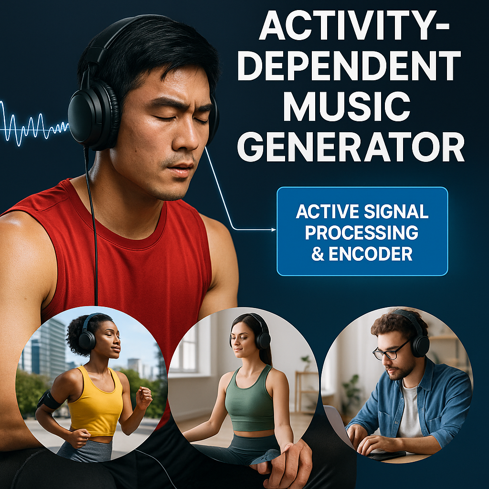
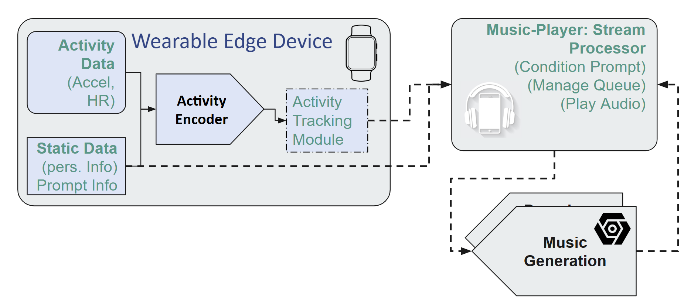

# MUSE: User-Sensitive musical Expression

#### Activity-Sensitive Generative Music
MUSE is a system designed to provide active, low-latency audio stimulation aimed at enhancing motivation, focus, and mood stabilization. By fusing real-time activity data with stimulatory audio generation, MUSE seeks to improve focus and task performance.
The system leverages systematically finetuned mobile-data encoder linked to a pretrained audio decoder within a joint embedding (semantic latent-space) architecture.

Currently under commercial product development.

## Product Overview
 | 



## Repository Organization

This repository is structured as follows:

```
e6692-2025spring-FinalProject-MUSE-lm3963/
├── data/                   # Contains datasets used for training and evaluation
├── docs/                   # Documentation and project-related resources
│   └── service_archtr/     # Service architecture & runtime docs
├── dev/                    # Development: Model Training, Experiments and visualizations
├── models/                 # Pretrained models and model checkpoints
│   ├── decoder/            # Audio decoder finetunes (unused)
│   └── encoder/            # Activity-sensitive mobile-data encoders (email liam.mchugh@columbia.edu for weights)
├── src/                    # Source code for the project
|   ├── edge_acq/           # Data Acquisition/Test Processing, Streaming on edge device (Jetson/wearable)
│   |   └── data_prcs/      # Scripts for data preprocessing and augmentation
|   ├── edge_client/        # Client streaming processes on local machine (Laptop/iphone)
│   ├── core_prcs/          # MusicGen architecture and generation scripts
│   └── utils/              # Utility functions and helper scripts
├── results/                # Generated results, logs, and analysis.
├── tests/                  # Unit tests for the project
├── requirements.txt        # High-level dependencies
├── LICENCE                 # PolyForm noncommercial license description & warnings
└── README.md               # Project overview and instructions
```

### Key Links

- [Project Report (5.13.2025)](https://docs.google.com/document/d/1zrKnF0ciJ9SkFMEfH6NLzc4ACPADLBZMTX92izYoTfI/edit?usp=sharing)

- [Project Presentation (5.13.2025)](https://docs.google.com/presentation/d/1A4nk4Ospce7u2O_nVVZyAI0OlnZDigZH9pl_1U1-LgY/edit?usp=sharing)

- [Project Proposal Document](https://docs.google.com/document/d/1ysuf-gNWOS9CF6A7tQjX72crqGVqCAQJkAoN8FW9xHg/edit?usp=drive_link)


- [Facebook Research’s MusicGen Model Card](https://github.com/facebookresearch/audiocraft/blob/main/model_cards/MUSICGEN_MODEL_CARD.md)
- [MusicGen Fragment Streaming App (Sanchit Gandhi)](https://huggingface.co/spaces/sanchit-gandhi/musicgen-streaming)
- [SigLIP2 Zero-Shot Image Classification](https://huggingface.co/collections/google/siglip2-67b5dcef38c175486e240107)
- [CoreML - Apple Developer Platform](https://developer.apple.com/documentation/coreml)
- [Spotify’s AI Playlist Generator](https://www.reddit.com/r/spotify/comments/1fxxboq/lets_talk_about_ai_playlists/)
- [State of Generative Music & Audio-Generative Architectures](https://datasciencedojo.com/blog/5-ai-music-generation-models/)
- [Prof. DiCarlo’s work on human visual-perceptive control](https://openreview.net/pdf?id=5GmTI4LNqX)
- [MIT Media Lab’s Semantic Synth Programming](https://www.media.mit.edu/publications/ctag-neurips/)
- [NVIDIA Triton Temporal Fusion Transformer Architecture (OS)](#)
- [Mesgarani N.A.P. Lab work on BCI-Augmented Attentional Audio Control](https://advanced.onlinelibrary.wiley.com/doi/full/10.1002/advs.202401379)

### How to Run (offline mode)
1. Clone the repository:
    ```bash
    git clone https://github.com/username/e6692-2025spring-FinalProject-MUSE-lm3963.git
    cd e6692-2025spring-FinalProject-MUSE-lm3963
    ```
2. Install dependencies:
    ```bash
    pip install -r requirements.txt
    ```
3. Run the main script:
    ```bash
    python src/main.py
    ```
4. For detailed instructions, refer to the [docs/](docs/) directory.

### Additional Notes
- This project is being developed for commercial use.
- For academic/research development, contact liam.mchugh@columbia.edu
